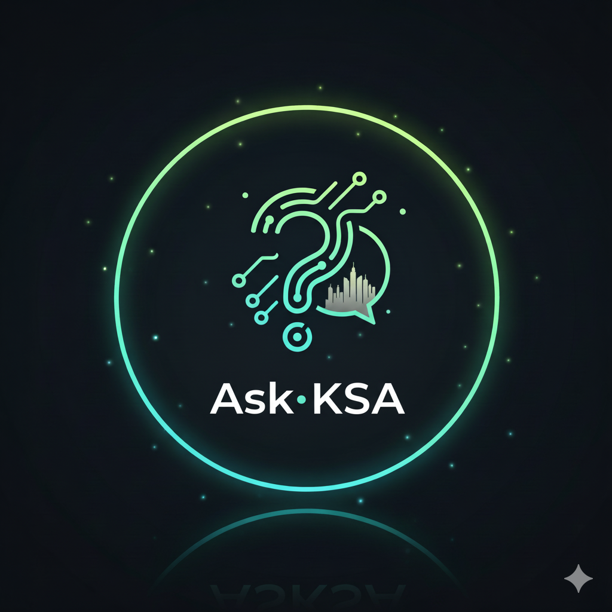

<p align="center">
  
</p>

<h1 align="center">AskKSA — Smart Bilingual Saudi Services Assistant</h1>

<p align="center">
  <strong>A modern modular RAG-powered assistant for Iqama, visa and Absher guidance.</strong>
  <br />
  Bilingual • Accurate • Fast • Modular Architecture
</p>

<p align="center">
  <a href="https://askksa.streamlit.app/">
    
  </a>
</p>

---

🔰 **Badges**

<p align="left">
  
  
  
  
  
  
  
</p>

---

## 📚 Table of Contents
- [Overview](#overview)
- [What Problem Does It Solve?](#what-problem-does-it-solve)
- [How It Solves These Problems](#how-it-solves-these-problems)
- [Features](#features)
- [Tech Stack](#tech-stack)
- [Architecture](#architecture)
- [Modular Project Structure](#modular-project-structure)
- [Installation & Local Setup](#installation--local-setup)
- [Live Demo](#live-demo)

---

## Overview

**AskKSA** is a modern **Retrieval-Augmented Generation (RAG)** assistant providing step-by-step help for:

- Saudi Arabia **Iqama**
- Exit/Re-entry visas
- Visit visas
- Absher services
- MOI processes
- Government portal guidance

The system ensures answers are:

✔ Grounded in validated Absher/official-source content  
✔ Bilingual (English + Urdu)  
✔ Structured, accurate, and easy to follow  
✔ Accessible through a clean chat interface  

The app uses **Gemini 2.5 Flash**, FAISS vector indexing, and a clean, modular Python codebase built with Streamlit.

---

## What Problem Does It Solve?

Saudi expats and residents often struggle with:

- Conflicting information about government services  
- Portal navigation issues  
- Confusion around document requirements  
- Step-by-step processes scattered across websites  
- Language accessibility (English/Urdu)

**AskKSA**:

- Centralizes accurate service information  
- Answers using *your curated dataset only*  
- Supports multilingual users  
- Provides fast, reliable guidance with sources  

---

## How It Solves These Problems

AskKSA uses **RAG** (Retrieval-Augmented Generation):

1. User asks a question (English or Urdu)  
2. Query is embedded using **BGE-M3**  
3. FAISS retrieves the top-K relevant chunks  
4. Gemini 2.5 Flash receives the injected context  
5. The model generates a grounded, verified answer  
6. The UI displays full answer + sources  

This ensures:

- ❌ No hallucinations  
- ❌ No invented rules  
- ✔ 100% context-grounded accuracy  

---

## Features

### ⭐ Core Features

- Fully bilingual (English + Urdu)  
- Auto language detection  
- Native Urdu rendering (Noto Nastaliq Urdu + RTL alignment)  
- “Helpful / Not Helpful” feedback system  
- Source links + similarity scores  
- Persistent chat history  
- Modern Streamlit UI with avatars  

### ⚙️ Technical Features

- Modular architecture  
- Sentence Transformers embeddings  
- FAISS vector search  
- Google Gemini 2.5 Flash model  
- Cached model/index loading  
- Extendable prompts via `prompts.py`  
- Configurable RAG pipeline via `config.py`  
- Swap models or dataset instantly  

---

## Tech Stack

### 🔹 **Frontend**
- Streamlit  
- Custom CSS (Urdu-friendly RTL rendering)  
- Google Fonts (Noto Nastaliq Urdu)

### 🔹 **Backend / AI**
- Google Gemini 2.5 Flash  
- Sentence Transformers (BAAI/bge-m3)  
- FAISS vector DB  

### 🔹 **RAG Data**
- `faiss_index_ip.bin`  
- `chunks.json`  
- `chunks_metadata.json`  
- Curated Absher/official content dataset  

---

## Architecture

```text
           ┌──────────────────────────────┐
           │     User Question (Eng/Urdu) │
           └──────────────────────────────┘
                          │
                          ▼
             ┌────────────────────────┐
             │  Embed (BGE-M3 Model)  │
             └────────────────────────┘
                          │
                          ▼
               ┌─────────────────────┐
               │   FAISS Retrieval   │
               └─────────────────────┘
                          │
                          ▼
       ┌──────────────────────────────────────┐
       │ Injected Context (Top-K Absher Data) │
       └──────────────────────────────────────┘
                          │
                          ▼
              ┌────────────────────────┐
              │ Gemini 2.5 Flash Model │
              └────────────────────────┘
                          │
                          ▼
           ┌──────────────────────────────┐
           │ Answer + Sources + Language  │
           └──────────────────────────────┘
```

---

## Modular Project Structure

To ensure scalability and maintainability, AskKSA now uses a **clean modular architecture**:

```text
askksa/
│
├── app.py                # Streamlit UI only
├── config.py             # Central configuration (paths, models, constants)
│
├── data_loader.py        # Loads FAISS index, embeddings, chunks, metadata
├── rag_core.py           # Retrieval + context builder + answer generator
├── llm_client.py         # Gemini client + unified LLM interface
├── prompts.py            # Prompt templates and language rules
│
├── faiss_index_ip.bin    # FAISS vector DB
├── chunks.json           # RAG text chunks
├── chunks_metadata.json  # Chunk metadata (titles, URLs)
│
├── AskKSA_Logo.png       # Branding asset
├── requirements.txt      # Dependencies
└── README.md             # Documentation
```

This structure allows:

* Swapping datasets without code changes
* Changing LLM models by editing one file
* Editing prompts without touching logic
* Adding future languages easily
* Clean unit testing

---

## Installation & Local Setup

### 1. Clone the repo

```bash
git clone https://github.com/arahmanmdmajid/DS_AI_11
cd DS_AI_11/askksa
```

### 2. Create a virtual environment

```bash
python -m venv venv
source venv/bin/activate        # macOS/Linux
venv\Scripts\activate           # Windows
```

### 3. Install dependencies

```bash
pip install -r requirements.txt
```


### 4. Add your Gemini API key

* Rename the **`sample_secrets.toml`** file to **`secrets.toml`** and add your API key:

  * **Path**: `.streamlit/secrets.toml`
  * Format:

    ```toml
    [general]
    GOOGLE_API_KEY = "your_key_here"
    ```

* Or you can also add your Gemini API key as an environment variable

```bash
set GOOGLE_API_KEY="your_key_here"
```

### 5. Run locally

```bash
streamlit run app.py
```

---

## Live Demo

🚀 **Try AskKSA here:**
👉 [https://askksa.streamlit.app/](https://askksa.streamlit.app/)
